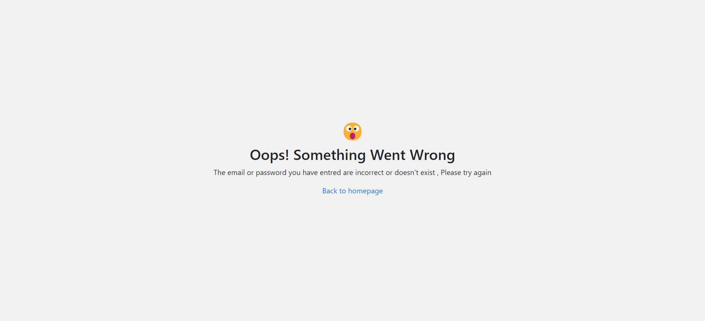

# Sign In - Sign Up App

This is a small app or a project which you can fork on your future Apps , it contains the Login process with a Database and Google - Facebook - Github (LinkedIn and other platforms are on demand) , also it alows to create a normal user in db With an email address

## Table of contents

- [Overview](#overview)
  - [How To Use](#how-to-use)
  - [The Challenge](#the-challenge)
  - [Screenshot](#screenshot)
  - [Links](#links)
- [My process](#my-process)
  - [Built with](#built-with)
- [Author](#author)
- [Acknowledgments](#acknowledgments)

## Overview

### How To Use

- First of all , After Foring the project ,you should create a .env file on the following path ( server/config ) for the Secret Keys of each platform and link to your DB,
  then fill in the following Form and past it on the file

---

    PORT= your port number
    MONGO_URL= Your MongoDB Url
    GOOGLE_CLIENT_ID     = Google Client ID  (Check bellow for more informations)
    GOOGLE_CLIENT_SECRET = Google CLient Secret  (Check bellow for more informations)
    CookieSecret         = your coockie secret , it can be any chossen word
    GITHUB_CLIENT_ID     = Github Client ID  (Check bellow for more informations)
    GITHUB_CLIENT_SECRET = Github Secret ID  (Check bellow for more informations)
    FACEBOOK_APP_ID      = Facebook App ID  (Check bellow for more informations)
    FACEBOOK_APP_SECRET  = Facebook App secret  (Check bellow for more informations)

---

- Google Client ID = [Click Me !](https://www.balbooa.com/gridbox-documentation/how-to-get-google-client-id-and-client-secret)
- Google Client Secret = [Click Me !](https://www.balbooa.com/gridbox-documentation/how-to-get-google-client-id-and-client-secret)
- Github Client ID = [Click Me !](https://www.knowband.com/blog/user-manual/get-github-client-id-client-secret-api-details/)
- Github Client Secret = [Click Me !](https://www.knowband.com/blog/user-manual/get-github-client-id-client-secret-api-details/)
- Facebook App ID = [Click Me !](https://goldplugins.com/documentation/wp-social-pro-documentation/how-to-get-an-app-id-and-secret-key-from-facebook/)
- Facebook App Secret = [Click Me !](https://goldplugins.com/documentation/wp-social-pro-documentation/how-to-get-an-app-id-and-secret-key-from-facebook/)

### The challenge

Users should be able to:

- Login in using Email and Password ( from Database)
- Login Using Social Media Platforms Like ( Google , Facebook,Twitter...)
- Sign up an account on the Database
- Edit Informations like UserName,Password,Avatar...

### Screenshot

#### Sign In Page :

#### Sign UP Page :

#### Home Page :

#### Error Page :

### Links

- Solution URL: [Click me !!](https://github.com/aymendev1/Authentication-App-Social-Media-Accounts-)

### Built with

- Semantic HTML5 markup
- CSS custom properties
- Flexbox
- JavaScript
- NodeJs
- ExpressJs
- Body Parser
- PassportJS
- DotEnv - Encryption
- MongoDB - Database
- Mongoose - Database Library
- [FontAwesome](https://fontawesome.com/) - Icons Library

## Author

- Github UserName : AymenDev1
- Portfolio : [Click me !](https://aymendev1.com)
- LinkedIn Profile :[Click Me !](https://linkedin.com/aymanazougar)
